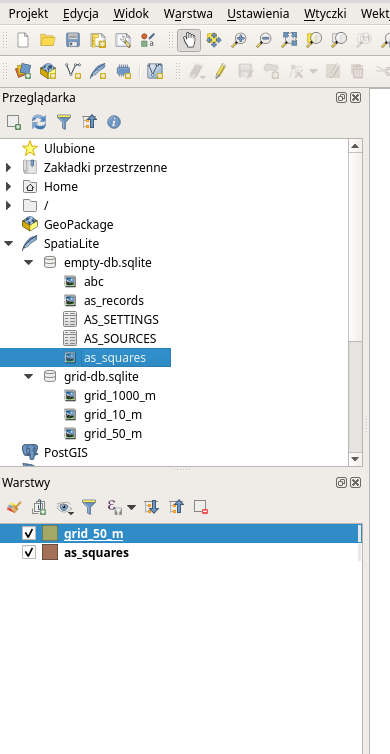
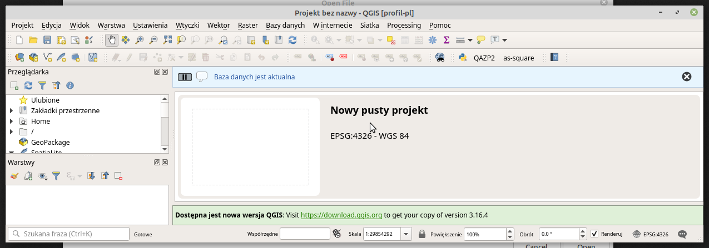

# AS-SQUARE Podręcznik użytkownika

`AS-SQUARE` to wtyczka do programu [QGIS](https://qgis.org), która wspomaga
użytkowników w zapisywaniu wyników archeologiczne prospekcji terenowej.
Dane zapisywane są w przestrzennej bazie danych zgodnie z metodą Kwadratów 
analitycznych.

Informacje zapisane w przestrzennej bazie danych [Spatialite](https://www.gaia-gis.it/fossil/libspatialite/home) wczytane 
w QGIS jako warstwa wektorowa mogą być wykorzystane do analiz przestrzennych.

## Licencja

Wtyczka `AS-SQUARE` jest udostępniana na warunkach [Licencji Publicznej Unii Europejskiej](https://github.com/archeocs/as-square/blob/main/LICENCE-PL.md).
Uruchomienie wtyczki oznacza akceptację jej postanowień.

Program jest udostępniany bez żadnych gwarancji. Autorzy nie biorą odpowiedzialności za
szkody powstałe w wyniku użytokwania programu.

## Instalacja

Wtyczkę `AS-SQUARE` można zainstalować przy pomocy mechanizmu obsługi wtyczek, 
który jest wbudowany w programie QGIS. Aplikacja umożliwia użytkownikom pobieranie i
instalowanie rozszerzeń z tak zwanych _repozytoriów_.

Przed instalacją wtyczki `AS-SQUARE` konieczne jest podanie adresu repozytorium, 
z którego QGIS pobiera pliki niezbędne do instalacji albo aktualizacji do najnowszej 
wersji.

Repozytorium `AS-SQUARE` znajduje się pod adresem **https://github.com/archeocs/as-square/releases/latest/download/plugins.xml**

### Dodawanie repozytorium w programie QGIS

1. Z menu `Wtyczki` wybierz `Zarządzanie wtyczkami...`.

2. Po lewej stronie okna wybierz sekcję `Ustawienia`.
3. Przewiń suwakiem z prawej strony do momentu aż będzie widoczna sekcja `Repozytoria wtyczek`.

4. Kliknij przycisk `Dodaj`.
5. W polu `Name` podaj dowolną nazwę repozytorium. Na przykład `wtyczka as-square`.
6. W polu `URL` wpisz adres repozytorium **https://github.com/archeocs/as-square/releases/latest/download/plugins.xml**

7. Naciśnij przycisk `OK`.
8. Naciśnij przycisk `Wczytaj ponownie zawartość repozytoriów`.
9. Naciśnij przycisk `Zamknij`.

Po konifiguracji repozytorium wtyczka `AS-SQUARE` powinna zostać wyświetlona na 
liście gotowych do instalacji. 

### Instalacja wtyczki

1. Z menu `Wtyczki` wybierz `Zarządzanie wtyczkami...`.
2. Po lewej stronie okna wybierz sekcję `Wszystkie`.
3. W polu tekstowym z lupą na górze okna wpisz `as-square`

4. Zaznacz wtyczkę `as-square`.
5. Kliknij przycisk `Zainstaluj wtyczkę`.
6. Po lewej stronie okna wybierz sekcję `Zainstalowane`.
7. Upewnij się, że wtyczka `as-square` znajduje się na liście i jest zaznaczona

8. Kliknij przycisk `Zamknij`.
9. Wyłącz program QGIS i uruchom ponownie.
10. Upewnij się, że przycisk `as-square` jest widoczny na pasku narzędzi na górze głównego 
   okna programu.
   
## Baza danych

Działanie wtyczki polega na zapisywaniu danych w przestrzennej bazie danych. Wtyczka jest
dostosowana do pracy z bazą [Spatialite](https://www.gaia-gis.it/fossil/libspatialite/home).
Każdorazowo przed rozpoczęciem pracy z wtyczką `AS-SQUARE` konieczne jest wczytanie z 
przestrzennej bazy danych odpowiedniej warstwy wektorowej o nazwie `AS_SQUARES`. 

Bazę danych z warstwą `AS_SQUARES` można pobrać 
[klikając na link](https://github.com/archeocs/as-square/releases/latest/download/empty-db.zip) 

Praca metodą kwadratów analitycznych polega na dodawaniu informacji archeologicznych dla
kwadratów o krawędzi 10 metrów lub 50 metrów, na które dzieli się obszar podlegający badaniom. 

1. Siatka kwadratów powinna zostać zapisana w warstwie wektorowej o nazwie:

* `GRID_10_M` dla siatki z kwadratami 10 metrów
* `GRID_50_M` dla siatki z kwadratami 50 metrów

2. Warstwa wektorowa powinna posiadać następujące atrybuty:

* `SQUARE_ID` - unikatowy identyfikator kwadratu w ramach siatki
* `GEOMETRY` - współrzędne geograficzne
* `SQUARE_DIMENSION` - zawiera stałą wartość: 50 dla warstwy `GRID_50_M` albo 10 dla `GRID_10_M`

## Aktualizacja

Aktualizacje wtyczki `AS-SQUARE` uzupełniają jej funkcje o nowe możliwości oraz naprawiają 
odkryte błędy. Użytkownik powinien regularnie sprawdzać najnowszą wersję programu. 

### Sprawdzanie wersji wtyczki

1. Z menu `Wtyczki` wybierz `Zarządzanie wtyczkami...`.
2. Po lewej stronie okna wybierz sekcję `Wszystkie`.
3. W polu tekstowym z lupą na górze okna wpisz `as-square`

4. Zaznacz wtyczkę `as-square`.
5. W panelu po prawej porównaj wartości `Zainstalowana wersja` oraz `Dostępna wersja`.

### Aktualizacja wtyczki

1. Z menu `Wtyczki` wybierz `Zarządzanie wtyczkami...`.
2. Po lewej stronie okna wybierz sekcję `Wszystkie`.
3. W polu tekstowym z lupą na górze okna wpisz `as-square`

4. Zaznacz `as-square` jeżeli jest widoczna na liście.
5. Kliknij przycisk `Aktualizuj wtyczkę`.

Po aktualizacji wtyczka może wymagać zmian w bazie danych, bez których nie będzie działała 
prawidłowo. Po każdej aktualizacji użytkownik powinien sprawdzić, czy wprowadzenie zmian 
jest konieczne. Wtyczka `AS-SQUARE` udostępnia użytkownikom funkcje do sprawdzania wersji 
bazy danych oraz wprowadzania koniecznych zmian.

### Sprawdzanie wersji bazy danych

1. Sprawdź, czy baza jest widoczna w panelu `Przeglądarka`.

2. Z menu `Wtyczki` wybierz `as-square` a następnie `Sprawdź bazę danych`.
3. Z rozwijanej listy wybierz bazę, która powinna zostać sprawdzona.

4. Kliknij przycisk `OK`.
5. Na górze ekranu pojawi się komunikat `Wykonaj migrację` należy przeprowadzić 
 migrację bazy.
 
6. Jeżeli komunikat mówi `Baza jest aktualna` to znaczy, że migrania nie jest 
konieczna.

### Migracja bazy danych

**UWAGA! Przed migracją bazy danych należy wykonać kopię bezpieczeństwa bazy!
Skopiuj plik bazy danych do innego katalogu. W przypadku niepowodzenia migracji
będziesz mógł go wykorzystać do przywrócenia poprzedniej wersji bazy**

1. Sprawdź, czy baza jest widoczna w panelu `Przeglądarka`.
2. Z menu `Wtyczki` wybierz `as-square` a następnie `Migruj bazę danych`.
3. Z rozwijanej listy wybierz bazę, która powinna zostać zaktualizowana.
4. Kliknij przycisk `OK`.
5. Jeżeli migracja zakończyła się powodzeniem, zostanie wyświetlony komunikat 
`Migracja zakończona sukcesem`.

6. Zamknij program QGIS i uruchom ponownie.

## Dodawanie informacji

Działanie wtyczki polega na zapisywaniu danych wprowadzonych w formularzu razem ze 
współrzędnymi z wybranego kwadratu analitycznego na warstwie wektorowej `AS_SQUARES`.
Po zapisaniu dane są gotowe do prowadzenia dowolnych analiz, które są wspierane 
przez program QGIS.

Dla każdego kwadratu informacje mogą być wprowadzane wielokrotnie (np. jeżeli badania
są powtarzane co pewien okres czasu).

### Dodawanie podstawowych informacji

1. Uruchom wtyczkę klikając w menu `Wtyczki` > `as-square` > `as-square`.
2. Na liście warstw wybierz warstwę z siatką kwadratów (`GRID_10_M` albo `GRID_50_M`).
3. Na warstwie zaznacz wybranych jeden kwadrat.
4. W formularzu wtyczki w polu `Kwadrat` zostanie wyświetlony identyfikator kwadratu
   (odczytany z atrybutu `SQUARE_ID`).
5. W formularzu wprowadz pozostałe informacje. Wszystkie pola są **nieobowiązkowe**.
6. Wprowadź informacje o klasyfikacji kulturowo-historycznej klikając przycisk 
   `Uruchom edytor` przy polu `Klasyfikacja`.
7. Kliknij przycisk `Dodaj`, aby zapisać wprowadzone informacje na warstwie `AS_SQUARES`.

### Dodawanie informacji o klasyfikacji kulturowo-historycznej

1. Po kliknięciu w przycisk `Uruchom edytor` w nowym oknie zostaje wyświetlona tabelka 
   do wprowadzania klasyfikacji kulturowo-historycznej
2. Klikinj przycisk `+` aby dodać do tabeli nowy wiersz.
3. Wprowadź informacje w kolumnach.
4. W kolumnach `Chronologia` wprowadź informacje o chronologii: 

   * Jeżeli chronologia rozciąga się między dwoma okresami, wprowadź pierwszy okres w 
     pierwszej kolumnie, drugi okres w drugiej kolumnie. W kolumnie `+/-` wybierz `-`
   
   * Jeżeli chronologia przypada na przełom dwóch okresów, , wprowadź pierwszy okres w 
     pierwszej kolumnie, drugi okres w drugiej kolumnie. W kolumnie `+/-` wybierz `/`
     
   * Jeżeli chronologia przypada na jeden okres, wprowadź go w pierwsze kolumnie. Drugą 
     kolumnę pozostaw pustą
     
   * Jeżeli określenie chronologii jest niepewne wprowadź wartość `?` w kolumnie `?`.
   
5. W kolumnach `Kultura` wprowadź informacje o kulturach archeologicznych.
6. Wprowadź ilość poszczególnych typów artefaktów.
7. Aby dodać kolejny wiersz wróć do kroku 2. 
8. Aby usunąć wiersz zaznacz go w tabeli i kliknij przycisk `-`.
9. Aby zatwierdzić zmiany kliknij przycisk `Ok`.
10. Aby odrzucić wszystkie zmiany kliknij przycisk `Anuluj`.

## Aktualizacja informacji
 
Informacje zapisane na warstwie `AS_SQUARES` mogą być edytowane na tej samej 
zasadzie, jak zostały dodane.

1. Uruchom wtyczkę klikając w menu `Wtyczki` > `as-square` > `as-square`.
2. Na liście warstw wybierz warstwę `AS_SQUARES`.
3. Na warstwie wybierz jeden kwadrat. Jeżeli pod danym kwadratem jest zapisanych
   więcej informacji, wyboru kwadratu można dokonać w tabeli atrybutów, którą 
   QGIS wyświetla dla wybranej warstwy.
4. Na formularzu wtyczki wyświetlają się wartości zapisane pod wybranym kwadratem.
5. Wprowadź niezbędne zmiany w formularzu.
6. Zmień informacje o klasyfikacji kulturowo-historycznej jeżeli to konieczne.
7. Kliknij przycisk `Aktualizuj` aby zatwierdzić wprowadzone zmiany. 

## Analizy przestrzenne

Przestrzenna baza danych używana we wtyczce `as-square` zawiera tabelę `AS_RECORDS`.
Tabela `AS_RECORDS` może być wykorzystana do analizy przestrzennej, w której musi być 
uwzględniona klasyfikacja kulturowo-historyczna. 

Tabela `AS_RECORDS` jest aktualizowana automatycznie przez wtyczkę `as-square`, 
gdy zmienia się tabela `AS_SQUARES` albo tabela `AS_SOURCES` i bezpośrednia modyfikacja 
jej zawartości jest niemożliwa. 
